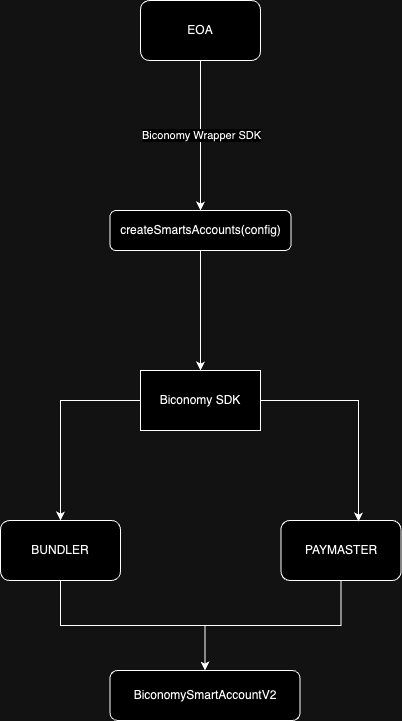

# Biconomy Wrapper SDK - Create & Deploy Smart Accounts easily 🛠️

Overview
The Biconomy platform has emerged as a pivotal tool for developers keen on leveraging Account Abstraction in the blockchain domain. Recognizing the escalating demand for a developer-friendly SDK to facilitate the effortless creation and deployment of smart accounts, we introduce the Biconomy Wrapper SDK.

Features
- Simplified interface for creating and deploying smart accounts.
- Multi-chain support for enhanced flexibility.
- Integrated account management for seamless user operations.

Installation
To integrate the Biconomy Wrapper SDK into your project:

```javascript
npm install biconomy-multichain-accounts-wrapper
```

Usage

1.SDK Integration

Import the necessary modules from the SDK:

```javascript
import { createSmartAccountMultichain, ChainId, SmartAccountV2MultiConfig } from 'biconomy-multichain-accounts-wrapper';
```

2.Configuration

Define the configuration parameters:
```javascript
const config: SmartAccountV2Config = {
  signer: yourSignerInstance,
  chainId: ChainId.POLYGON_MUMBAI,
  paymasterApiKey: 'YOUR_PAYMASTER_API_KEY',
  deployOnChain: {
    prefundAmount: ethers.utils.parseEther("0.1")
  }
};
```

3.Example Workflow

To create and deploy smart accounts on-chain:

If the ***deployOnChain*** field is omitted, the smart account will be instantiated but not deployed. Deployment will be triggered upon the first ***UserOperation***.

The optional ***deployOnChain*** field, if provided, requires ***prefundAmount***, which is needed for contract deployment and running transactions if no paymaster is used. Ensure adequate gas provisioning for each chain.

```javascript

const mumbaiProvider = new providers.JsonRpcProvider(process.env.MUMBAI_RPC_URL)  
const goerliProvider = new providers.JsonRpcProvider(process.env.GOERLI_RPC_URL)  

const mumbaiSigner = new ethers.Wallet(process.env.PRIVATE_KEY || "", mumbaiProvider);
const goerliSigner = new ethers.Wallet(process.env.PRIVATE_KEY || "", goerliProvider);

const configs: SmartAccountV2MultiConfig = [
        { 
          signer: mumbaiSigner,
          chainId: ChainId.POLYGON_MUMBAI,
          paymasterApiKey: {MUMBAI_PAYMASTER_ID},
          deployOnChain: {
            prefundAmount: ethers.utils.parseEther("0.01")
          }
        },
        { 
          signer: goerliSigner,
          chainId: ChainId.GOERLI,
          paymasterApiKey: {BSC_TESTNET_PAYMASTER_ID},
          deployOnChain: {
            prefundAmount: ethers.utils.parseEther("0.1")
          }
        }
    ]
```

Get the created smart accounts.

```javascript
const smartAccounts = await createSmartAccountMultichain(
    configs
);
```


Once the smart accounts are created you can start using them.

```javascript
const smartAccount = smartAccounts[0];
  
const transaction = {
    to: await smartAccount.getAccountAddress() || "",
    data: '0x',
}

const userOp = await smartAccount?.buildUserOp([transaction])
userOp.paymasterAndData = "0x"

const userOpResponse = await smartAccount.sendUserOp(userOp)

const transactionDetail = await userOpResponse.wait()

console.log("transaction detail below")
console.log(transactionDetail)
```

If you wish to deploy another smart account from the same private key, use ***index*** field, it is an extra salt that allows to deploy more accounts for same EOA (default 0)

```javascript
const configs: SmartAccountV2MultiConfig = [
        { 
          signer: mumbaiSigner,
          chainId: ChainId.POLYGON_MUMBAI,
          paymasterApiKey: {MUMBAI_PAYMASTER_ID},
          deployOnChain: {
            prefundAmount: ethers.utils.parseEther("0.01")
          },
          index: 1
        }
    ]
```

***Functions***
- ***createSmartAccountMultichain***(configs: SmartAccountV2MultiConfig[]): Promise<SmartAccount[]>

Parameters:
configs: Array of configurations for creating smart accounts.
Returns: Promise that resolves to an array of created smart accounts.

***Types***
- SmartAccountV2Config 
- SmartAccountV2MultiConfig
- BaseSmartAccountConfigOptionals
- BiconomySmartAccountV2ConfigOptionals

***ChainId***

Enum for supported blockchain chains. Examples:
- POLYGON_MUMBAI
- GOERLI

***Troubleshooting***

In the validateSmartAccountConfig function:

- "Signer is required.": This error is thrown if the signer property is not provided in the SmartAccountV2Config configuration object.
- "Chain ID is required.": This error is thrown if the chainId property is not provided in the SmartAccountV2Config configuration object.
- "Paymaster API KEY is required.": This error is thrown if the paymasterApiKey property is not provided in the SmartAccountV2Config configuration object.

In the checkDuplicate function:

- This function internally calls two other functions to check for duplicates: checkDuplicateChainIds and checkDuplicatePaymasterIds.

In the checkDuplicateChainIds function:

- "Duplicate chain ids not allowed.": This error is thrown if there are duplicate chainId values in the provided SmartAccountV2MultiConfig configuration array.

In the checkDuplicatePaymasterIds function:

- "Duplicate paymaster api keys not allowed.": This error is thrown if there are duplicate paymasterApiKey values in the provided SmartAccountV2MultiConfig configuration array.

In the createSmartAccount function:

- "Error on initializing module: [error message]": This error is thrown if there's an issue initializing the MultiChainValidationModule.
- "Error on initializing bundler: [error message]": This error is thrown if there's an issue initializing the Bundler.
- "Error on initializing paymaster: [error message]": This error is thrown if there's an issue initializing the BiconomyPaymaster.
- "Error on initializing biconomySmartAccount: [error message]": This error is thrown if there's an issue initializing the BiconomySmartAccountV2.

In the createSmartAccountMultichain function:

- This function internally calls the checkDuplicate function, which can throw errors related to duplicate values (as mentioned in the previous list).
- Additionally, since this function calls the createSmartAccount function for each configuration, any error that can be thrown by createSmartAccount can also be thrown here.

In the prefundSmartAccount function:

- While the function itself doesn't have explicit error throws, any error related to Ethereum transactions, such as insufficient funds, gas issues, or network errors, can arise when sending the transaction.

In the sendEmptyTx function:

- Similar to the prefundSmartAccount function, while there aren't explicit error throws, errors related to Ethereum transactions can arise. This includes issues with building the user operation, sending the user operation, or waiting for the transaction.

***Simple Workflow Schema***



This project is licensed under the MIT License. See the [LICENSE.md](./LICENSE.md) file for details.
